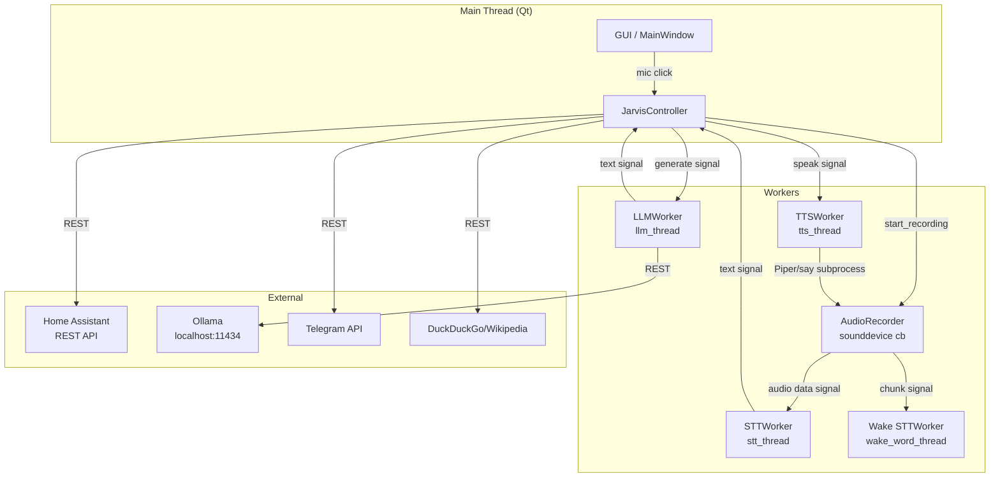
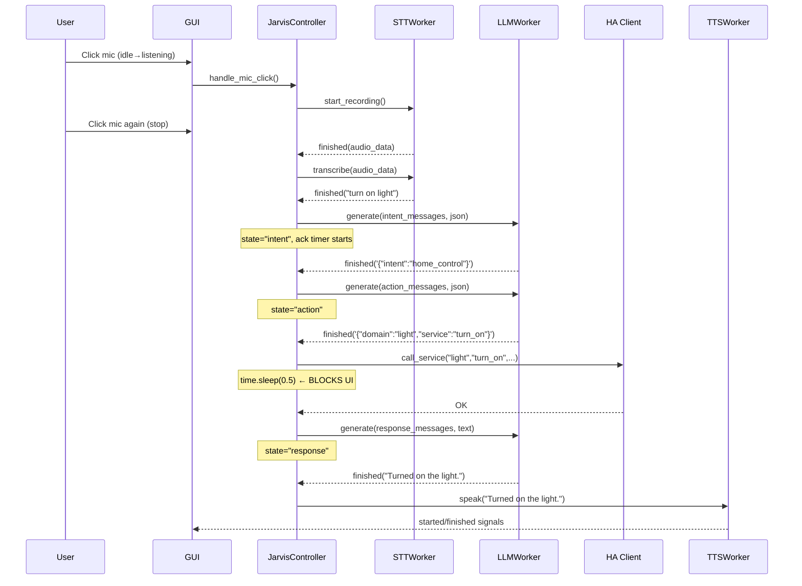

# Jarvis Assistant — Staff-Level Technical Assessment

> Generated: 2026-02-22
> Reviewer: Claude Sonnet 4.6 (Staff-Level Engineering Review)
> Branch: `v0.2`

---

## 0. Inspection Checklist

| # | Item | Status |
|---|------|--------|
| 1 | Top-level directory structure | ✅ |
| 2 | All source files in `jarvis_assistant/` | ✅ |
| 3 | `requirements.txt` + `requirements-dev.txt` | ✅ |
| 4 | `settings.json` (runtime config) | ✅ |
| 5 | `.gitignore` | ✅ |
| 6 | `entry.py`, `run.py` (entry points) | ✅ |
| 7 | `scripts/start.sh` | ✅ |
| 8 | `Jarvis Assistant.spec` (PyInstaller) | ✅ |
| 9 | `README.md`, `VERIFICATION.md`, `docs/` | ✅ |
| 10 | `tests/` directory | ✅ |
| 11 | Entire `main.py` (1355 lines) | ✅ |
| 12 | `agents.py`, `config.py`, `llm_client.py` | ✅ |
| 13 | `gui.py` (72 KB, 1500+ lines, partial scan) | ✅ |
| 14 | `ha_client.py`, `tts.py`, `stt.py` | ✅ |
| 15 | `audio_io.py`, `conversation.py`, `memory.py` | ✅ |
| 16 | `utils.py`, `ui_framework.py`, `intent_utils.py` | ✅ |
| 17 | `profile_paths.py` | ✅ |
| 18 | Git history and status | ✅ (via status provided) |
| 19 | CI/CD files | ✅ (none found) |
| 20 | Docker/container files | ✅ (none found) |

---

## 1. Repo Inventory

### App Type
Desktop GUI application — macOS-native, single-process, voice-first Smart Home AI assistant.

### Tree Summary
```
5Refinement Kopie/
├── entry.py                   # Entry point (sys.path hack + main())
├── run.py                     # Alternate entry (JarvisController directly)
├── requirements.txt           # Production deps (8 packages, mostly unpinned)
├── requirements-dev.txt       # Dev deps (pytest only)
├── settings.json              # Runtime config (in .gitignore; contains live secrets)
├── Jarvis Assistant.spec      # PyInstaller bundle definition
├── jarvis_assistant/          # Main Python package
│   ├── __init__.py
│   ├── main.py                # JarvisController (1355 lines) — orchestration
│   ├── config.py              # Config class + global `cfg` singleton
│   ├── gui.py                 # All PyQt6 UI (~72 KB, 1500+ lines)
│   ├── agents.py              # IntentAgent, ActionAgent, ResponseAgent prompts
│   ├── llm_client.py          # LLMWorker — Ollama/OpenAI/Gemini/OpenCode
│   ├── ha_client.py           # HomeAssistantClient (REST API)
│   ├── tts.py                 # TTSWorker — Piper + macOS `say` fallback
│   ├── stt.py                 # STTWorker — faster-whisper
│   ├── audio_io.py            # AudioRecorder (sounddevice streams)
│   ├── conversation.py        # Conversation history (JSON persistence)
│   ├── memory.py              # MemoryManager (key-value JSON facts)
│   ├── utils.py               # Logging setup + extract_json()
│   ├── ui_framework.py        # Custom widget primitives (squircle, animations)
│   ├── intent_utils.py        # parse_delay_seconds(), is_multi_domain_request()
│   ├── profile_paths.py       # Profile file path helpers
│   ├── model_catalog.json     # Curated Ollama model list
│   └── assets/icons/          # UI icons
├── tests/
│   └── test_stabilization.py  # 6 unit tests (intent_utils + profile_paths)
├── scripts/
│   └── start.sh               # Launcher (brew + venv + ollama + python)
├── docs/
│   ├── HANDOFF.md
│   └── git_workflow.md
├── SmartHome-AI/              # Obsidian notes vault (not source code)
├── HA_Scripts/                # HA automation scripts
├── history/                   # Conversation JSON files (gitignored pattern)
├── memory/                    # Memory JSON files (gitignored pattern)
├── build/, dist/              # PyInstaller artifacts (committed!)
└── opencode/                  # Third-party tooling directory (committed!)
```

### Languages & Frameworks
- **Python 3.11** — sole application language
- **PyQt6** — GUI framework (signals, threads, animation)
- **faster-whisper** — local STT via ONNX/CTranslate2
- **Piper TTS** — local neural TTS
- **Ollama** — local LLM inference (primary); also supports OpenAI, Gemini, OpenCode APIs
- **sounddevice** — audio I/O

### Entry Points

| File | Command | Notes |
|---|---|---|
| `scripts/start.sh` | `bash scripts/start.sh` | Installs deps + launches |
| `run.py` | `python run.py` | Preferred after setup |
| `entry.py` | `python entry.py` | `sys.path` patching variant |
| `jarvis_assistant/main.py` | `python -m jarvis_assistant.main` | Module invocation |

### Config & Ops Files

| File | Role |
|---|---|
| `settings.json` | Persistent runtime settings (JSON); gitignored but present on disk |
| `Jarvis Assistant.spec` | PyInstaller bundle |
| `scripts/start.sh` | Dev/user launcher |
| `.gitignore` | Standard Python; includes `settings.json`, `memory/`, `history/` |

### Tests
- **Runner**: pytest
- **Location**: `tests/test_stabilization.py` only
- **Coverage**: 6 tests for `intent_utils` and `profile_paths` — ~5% of codebase covered
- **Root-level test files**: 9 throwaway `test_pyttsx3_v*.py` scripts, `test_app.py`, `test_gpu.py`, `test_ha_connection.py` — not in `tests/`, not pytest-collected by default

### Secret Exposure Locations

| Location | Secret Type | Status |
|---|---|---|
| `settings.json:8` | `ha_token` — real HA JWT | On disk; gitignored now |
| `settings.json:30` | `telegram_bot_token` — real bot token | On disk; gitignored now |
| `settings.json:31` | `telegram_chat_id` | On disk; gitignored now |
| `jarvis_assistant/config.py:13` | `DEFAULT_HA_URL` = `http://192.168.188.126:8123` | Internal IP in source |
| `jarvis_assistant/llm_client.py:380` | Gemini API key appended to URL query param | In URL, exposed to logs |

---

## 2. How to Run

### A) Minimal Local Run

**Prerequisites:**
```
- macOS (Sequoia 15.x tested)
- Python 3.11
- Homebrew
- Ollama (or OpenAI/Gemini API access)
- Microphone access permission
```

**Install steps:**
```bash
# 1. Clone repo
git clone <repo-url> jarvis && cd jarvis

# 2. Create env vars (no .env.example exists — see Section 7 for proposed one)
export HA_TOKEN="your-ha-long-lived-token"
export HA_URL="http://your-ha-host:8123"

# 3. System deps (macOS)
brew install portaudio ffmpeg

# 4. Python venv
python3.11 -m venv .venv && source .venv/bin/activate
pip install -r requirements.txt

# 5. Ensure Ollama running and model pulled
ollama serve &   # or open Ollama.app
ollama pull qwen2.5:0.5b

# 6. Run
python run.py
```

**Verify:** A window titled "AI" (or configured `assistant_name`) opens with a circular mic button. Status label shows "Idle".

**Missing items:**
- No `.env.example`
- No `Makefile` / `justfile`
- No `setup.py` / `pyproject.toml`
- `scripts/start.sh` hardcodes `OLLAMA_MODEL="qwen2.5:0.5b"` even if `settings.json` uses a different model

### B) Test Run

```bash
# Unit tests only
pip install -r requirements-dev.txt
pytest tests/ -v

# Compile check (all modules)
python -m py_compile jarvis_assistant/*.py

# HA integration test (requires live HA)
python test_ha_connection.py
```

**Coverage generation:** Not configured — `pytest --cov` would need `pytest-cov` added to `requirements-dev.txt`.

### C) Build / Package (macOS .app)

```bash
pip install pyinstaller
pyinstaller "Jarvis Assistant.spec"
# Output: dist/Jarvis Assistant.app
```

**Missing:** Bundled build artifacts (`build/`, `dist/`) are committed to the repo — remove them.

---

## 3. Architecture Snapshot

### Modules and Responsibilities

| Module | Responsibility |
|---|---|
| `main.py / JarvisController` | Orchestration: state machine, signal wiring, all intent routing |
| `config.py / Config` | Settings: load/save `settings.json`, expose typed properties |
| `gui.py / MainWindow + SettingsDialog` | All UI: mic button, chat bubbles, settings dialog, resource monitor |
| `agents.py` | Prompt templates only — IntentAgent, ActionAgent, ResponseAgent |
| `llm_client.py / LLMWorker` | LLM API calls: Ollama, OpenAI, Gemini, OpenCode; model management |
| `ha_client.py` | Home Assistant REST API: states, services, helpers, to-dos |
| `tts.py / TTSWorker` | TTS: Piper (ONNX) primary, macOS `say` / pyttsx3 fallback |
| `stt.py / STTWorker` | STT: faster-whisper transcription |
| `audio_io.py / AudioRecorder` | Mic capture: push-to-talk recording + wake word streaming |
| `conversation.py` | Conversation history: in-memory list + JSON persistence |
| `memory.py` | User facts: key-value store + JSON persistence |
| `utils.py` | Logging setup + `extract_json()` |
| `intent_utils.py` | Pure functions: delay parsing, multi-domain detection |
| `profile_paths.py` | Profile file path resolution |
| `ui_framework.py` | Widget primitives: squircle path, BioMechCasing, animations |

### Data Flow

```
User Voice
  → AudioRecorder (sounddevice callback thread)
  → STTWorker.transcribe() [stt_thread]
  → handle_stt_finished() [main thread via signal]
  → start_processing()
    → IntentAgent prompt → LLMWorker.generate() [llm_thread, raw threading.Thread]
    → handle_llm_response() state="intent" [main thread via queued signal]
      ├─ conversation: direct reply → TTSWorker.speak() [tts_thread]
      ├─ home_control → ActionAgent prompt → LLMWorker.generate() [llm_thread]
      │   → handle_llm_response() state="action"
      │     → _execute_action() [⚠️ blocks main thread 0.5s]
      │     → start_response_agent()
      ├─ web_search → _web_search() [⚠️ blocks main thread up to 10s]
      ├─ telegram_send → _send_telegram_message() [⚠️ blocks main thread]
      └─ other intents → start_response_agent()
           → ResponseAgent prompt → LLMWorker.generate()
           → handle_llm_response() state="response"
           → TTSWorker.speak() [tts_thread]

User Text Input
  → handle_text_input() → start_processing() (same path as above)

Wake Word
  → AudioRecorder.wake_word_chunk [wake_word_thread]
  → wake_word_stt.transcribe()
  → handle_wake_word_detected() [main thread]
  → auto-start push-to-talk recording
```

### State Management & Persistence

| Data | Format | Location | Notes |
|---|---|---|---|
| Conversation history | JSON array | `history/history_{profile}.json` | Last 50 messages |
| User memory facts | JSON object | `memory/memory_{profile}.json` | Unbounded size |
| Settings | JSON object | `settings.json` | Loaded at import time |
| App state | Instance vars | `JarvisController` | `current_state`, `current_intent`, `current_action_taken`, `pending_action` |

### External Integrations
- **Home Assistant**: REST API (`/api/states`, `/api/services/*`, `/api/config/*`)
- **Ollama**: Local REST API (`http://127.0.0.1:11434`)
- **OpenAI API**: `api.openai.com/v1/chat/completions`
- **Gemini API**: `generativelanguage.googleapis.com`
- **OpenCode**: `opencode.ai/zen/v1/*`
- **Telegram Bot API**: `api.telegram.org/bot{token}/sendMessage`
- **DuckDuckGo** + **Wikipedia**: Web search (HTML scraping)
- **Hugging Face**: Piper model downloads

### Error Handling & Logging
- All modules log to `jarvis.log` (rotating append) + stdout via `utils.setup_logging()`
- LLM/STT/HA errors emit signals caught in `handle_error()` which resets UI state
- HTTP calls: bare `except Exception as e` everywhere — no distinction between transient and fatal errors
- No retry logic except Ollama connection retry (force-start path)

### Concurrency Model

```
Main Thread (Qt event loop)
├── GUI rendering + event dispatch
├── handle_stt_finished / handle_llm_response / handle_tts_*  ← signal handlers
├── _execute_action() with time.sleep(0.5) ← BLOCKS MAIN THREAD
├── _web_search() with requests.get(timeout=10) ← BLOCKS MAIN THREAD
└── _send_telegram_message() with requests.post(timeout=10) ← BLOCKS MAIN THREAD

stt_thread (QThread)         → STTWorker.transcribe() (faster-whisper)
wake_word_thread (QThread)   → STTWorker.transcribe() (faster-whisper)
llm_thread (QThread)         → spawns raw threading.Thread per generate() call ⚠️
tts_thread (QThread)         → TTSWorker.speak() (Piper CLI subprocess / say)

sounddevice callbacks        → AudioRecorder frames mutation ← RACE CONDITION
GPU monitor thread           → daemon thread per 2s update
Piper download thread        → daemon thread
```

**Race conditions:**
1. `AudioRecorder.frames` / `wake_word_buffer` mutated from sounddevice callback thread without a lock
2. `LLMWorker._cancel_requested` read/written from multiple threads without a lock
3. `LLMWorker.generate()` called directly on a QThread-owned object from the main thread

### Mermaid Diagrams





---

## 4. Audit Findings

### 1. Correctness / Logic Bugs

#### [Critical] `_sanitize_reply` URL regex is broken
- **File:** `jarvis_assistant/main.py:1297`
- **Code:** `re.sub(r"https?://\\S+", "", cleaned)` — `\\S` in a raw string is literal `\S`, not the regex class `\S`. URLs are never stripped from TTS text.
- **Fix:** Change to `re.sub(r"https?://\S+", "", cleaned)`

#### [High] `Conversation.__init__` crashes on bare filename
- **File:** `jarvis_assistant/conversation.py:25`
- **Code:** `os.makedirs(os.path.dirname(self.history_file), exist_ok=True)` — if `history_file` is `"conversation_history.json"` (no directory), `dirname` returns `""` and `makedirs("")` raises `FileNotFoundError`.
- **Fix:** `parent = os.path.dirname(self.history_file); if parent: os.makedirs(parent, exist_ok=True)`

#### [High] `_build_input_number_action` relative delta logic is flawed
- **File:** `jarvis_assistant/main.py:232-242`
- Condition `if any(tok in text for tok in ["a little"...]):` only sets `relative_delta` if `relative_delta is None`, but the check for "a little" happens *after* "down" and "up" checks. If user says "turn it down a little", `relative_delta` is `-1`, then the "a little" block sets it to `-1` again — no scaling. The "a lot" block has the same off-by-one bug (it's supposed to multiply but only sets `-2`).
- **Fix:** Use a multiplier system; separate magnitude words from direction words.

#### [Medium] `MemoryManager.add_fact` timestamp key collision
- **File:** `jarvis_assistant/memory.py:13` / `main.py:864`
- **Key:** `f"fact_{int(time.time())}"` — same-second writes overwrite each other.
- **Fix:** Use `f"fact_{int(time.time() * 1000)}"` or UUID.

#### [Medium] Multi-domain guard fires before HA entity list loads
- **File:** `jarvis_assistant/main.py:764-770`
- `_is_multi_domain_request(user_text)` uses `self._parse_entities()` which parses `self.ha_entities`. If HA is offline at startup, `ha_entities` is an error string and no entities are parsed — the guard silently never fires.

#### [Medium] Wake word STT transcribes chunks with no language filter
- **File:** `jarvis_assistant/stt.py:59`
- `self.model.transcribe(audio_data, beam_size=5, language=cfg.language)` — `cfg.language` can be `None`, which tells Whisper to auto-detect per chunk. This causes false positives on noise.

#### [Low] `handle_recording_finished` is defined but never connected
- **File:** `jarvis_assistant/main.py:678`
- The method exists but the signal `audio_recorder.finished` is connected to `self.stt_worker.transcribe` at line 79, bypassing this handler entirely.

---

### 2. Security

#### [Critical] Live secrets stored in `settings.json`
- **File:** `settings.json` (root)
- **Evidence:** `"ha_token": "eyJhbGciOiJIUzI1NiIsInR5cCI6IkpXVCJ9..."`, `"telegram_bot_token": "8300133934:..."`, `"telegram_chat_id": "5100045652"`
- The file is currently gitignored, but if it was ever committed (check `git log --all -- settings.json`), these are in git history.
- **Immediate action required:** Rotate HA long-lived token, revoke and regenerate Telegram bot token.

#### [High] Internal IP hardcoded in source
- **File:** `jarvis_assistant/config.py:13`
- `DEFAULT_HA_URL = "http://192.168.188.126:8123"` — internal network topology exposed in source code.
- **Fix:** Remove the hardcoded IP; use env var only with a documented placeholder.

#### [High] Gemini API key leaked into request URL
- **File:** `jarvis_assistant/llm_client.py:380`
- `url = f"https://generativelanguage.googleapis.com/v1beta/models/gemini-2.5-flash:generateContent?key={cfg.api_key}"`
- API keys in URLs appear in access logs, proxies, browser history, and `requests` debug output.
- **Fix:** Use `X-goog-api-key` header instead.

#### [High] Shell injection surface in GPU stats
- **File:** `jarvis_assistant/gui.py:376`
- `subprocess.run(cmd, shell=True, ...)` — `cmd` is a hardcoded string here, so no immediate injection, but `shell=True` is a dangerous pattern that should not be in production code.
- **Fix:** Pass as list or restructure without shell.

#### [Medium] `pkill afplay` kills all system audio
- **File:** `jarvis_assistant/tts.py:354`
- `subprocess.run(["pkill", "afplay"])` — kills every `afplay` process owned by the user, including music players and system sounds.
- **Fix:** Track PID of spawned `afplay` subprocess and kill only that PID.

#### [Medium] `_web_search` HTML parsing without sanitization
- **File:** `jarvis_assistant/main.py:477-492`
- `unescape(re.sub(r"<.*?>", "", match.group(2))).strip()` — malicious HTML from search result titles is partially processed. Low risk since output is only sent to TTS/display, not exec'd.

#### [Low] Conversation history stored as plain JSON
- **Files:** `history/*.json`, `memory/*.json`
- No encryption; contains full conversation transcripts and user facts.

---

### 3. Reliability

#### [Critical] Blocking I/O in main thread freezes the GUI
- **File:** `jarvis_assistant/main.py:336, 437, 465`
- `time.sleep(0.5)` in `_execute_action` is called from `handle_llm_response`, a signal handler running in the **main thread**.
- `requests.post(url, ..., timeout=10)` in `_send_telegram_message` — also main thread.
- `requests.get("https://duckduckgo.com/...", timeout=10)` in `_web_search` — also main thread.
- During any of these, the UI is completely frozen.
- **Fix:** Move all HTTP calls to QThread workers with signals.

#### [Critical] `LLMWorker.generate()` called directly on thread-owned object
- **File:** `jarvis_assistant/main.py:794, 897, 1119`
- `self.llm_worker.generate(messages, format="json")` — `llm_worker` is moved to `llm_thread` but is called directly from the main thread. Qt requires cross-thread method calls to go through signals/slots for QObjects. This is a thread-safety violation.
- The `request_llm` signal exists at line 33 but is never used for actual generation.
- **Fix:** Replace direct calls with `self.request_llm.emit(messages)` (needs format parameter — add `request_llm = pyqtSignal(list, str)`).

#### [High] `AudioRecorder.frames` list is a data race
- **File:** `jarvis_assistant/audio_io.py:27-30`
- `self.frames.append(indata.copy())` runs in sounddevice's callback thread; `stop_recording` reads `self.frames` from the main thread. No mutex.
- **Fix:** Use `collections.deque` with a `threading.Lock`, or use a `queue.Queue`.

#### [High] `_ack_timer` can fire after `current_state` reset
- **File:** `jarvis_assistant/main.py:1135-1149`
- If the LLM responds very fast (before the 3s ack timer fires) and resets `current_state = "idle"`, the timer could still fire and emit TTS. The guard at line 1136 mitigates this but is not atomic with the timer reset.

#### [High] HA entity list is fetched synchronously in `__init__`
- **File:** `jarvis_assistant/main.py:44`
- `self.ha_entities = self.ha_client.get_relevant_entities()` — 5-second timeout blocking call during construction. If HA is down, startup hangs for 5 seconds.
- **Fix:** Fetch asynchronously with a `QTimer.singleShot()` after `window.show()`.

#### [Medium] `LLMWorker._cancel_requested` flag has no memory barrier
- **File:** `jarvis_assistant/llm_client.py:23, 105, 127`
- Set from the GUI thread, read from a raw `threading.Thread`. In CPython, GIL makes this practically safe but it's not formally correct.
- **Fix:** Use `threading.Event`.

#### [Medium] Scheduled QTimers (`_scheduled_tasks`) never cancelled
- **File:** `jarvis_assistant/main.py:389-390`
- Timers are appended to `_scheduled_tasks` but never removed after firing. Long sessions accumulate dead timer objects.

#### [Medium] `start.sh` silently upgrades pip and all packages on every run
- `pip install --upgrade pip` + `pip install -r requirements.txt` (unpinned) will upgrade everything on each start, potentially breaking the environment.

---

### 4. Performance

#### [High] Entire HA entity list serialized into every LLM prompt
- **File:** `jarvis_assistant/main.py:778, 894, 1089`
- Every LLM call (intent + action + response) includes the full entity list as a string. With 100+ entities this is thousands of tokens per turn, tripling inference cost.
- **Fix:** Pass a summarized entity list to intent/response agents; pass the full list only to the action agent.

#### [High] `get_squircle_path` computes 201 points every `paintEvent`
- **File:** `jarvis_assistant/ui_framework.py:42-51`
- Called repeatedly during animations (60 FPS). No caching.
- **Fix:** Cache the path and only recompute on resize.

#### [Medium] LLMWorker spawns a raw thread per inference call
- **File:** `jarvis_assistant/llm_client.py:33`
- `threading.Thread(target=self._run_generate, ...).start()` — no thread pool; could theoretically queue up many threads if `generate()` is called rapidly.

#### [Medium] `ResourceMonitor._fetch_gpu` spawns a new `threading.Thread` every 2 seconds
- **File:** `jarvis_assistant/gui.py:371`
- Overlapping threads if one takes longer than 2 seconds.

#### [Low] `Conversation.save()` writes to disk on every `add_message()` call
- **File:** `jarvis_assistant/conversation.py:41-44`
- Synchronous file I/O in the main thread on every user input.

---

### 5. Maintainability

#### [High] `gui.py` is 72 KB / 1500+ lines in a single file
- Contains: MicButton, ChatBubble, ResourceBar, ResourceMonitor, InteractiveTitleLabel, SettingsDialog, MainWindow, and multiple embedded settings pages — all in one file.
- **Fix:** Split into at least `gui_main.py`, `settings_dialog.py`, `widgets.py`.

#### [High] `main.py` is 1355 lines with 10+ unrelated responsibilities
- JarvisController handles: audio lifecycle, LLM orchestration, HA execution, scheduling, Telegram, web search, memory, TTS, wake word, confirmation flows, and capabilities description.
- **Fix:** Extract `HAExecutor`, `SchedulerService`, `TelegramService`, `WebSearchService` each into their own modules.

#### [Medium] Duplicate `import math / import time` inside `_on_frame`
- **File:** `jarvis_assistant/gui.py:96-99` — `import math` and `import time` inside a method that fires 60 times/second.

#### [Medium] `_pick_ack_phrase` is 120 lines of hard-coded strings
- **File:** `jarvis_assistant/main.py:1163-1285`
- Should be a config file or dataclass.

#### [Medium] Duplicated `# Refresh UI` comment
- **File:** `jarvis_assistant/main.py:170-171` — copy-paste artifact.

#### [Low] `llm_client_temp.py` deleted but was tracked in git
- Git status shows `D jarvis_assistant/llm_client_temp.py` — was a temp file that leaked into tracked state.

---

### 6. API / Contracts

#### [High] Intent agent prompted to output both plain text AND JSON
- **File:** `jarvis_assistant/agents.py:39-70`
- The controller checks `if not response.strip().startswith('{')` to detect conversation mode (`main.py:805`). Small models frequently fail to stay consistent.
- **Fix:** Enforce a single output format with a `"type": "conversation"` field; keep all responses as JSON.

#### [Medium] `extract_json` is greedy — matches first `{...}` in a response
- **File:** `jarvis_assistant/utils.py:49`
- `re.search(r'\{.*\}', text, re.DOTALL)` — DOTALL greedy match. If the response has multiple JSON objects, it captures the outermost span which may be malformed.

#### [Medium] `ActionAgent` prompt lists unsupported domains in examples
- **File:** `jarvis_assistant/agents.py:134-137`
- The example output includes `"domain": "light"` for `turn_on` but `_execute_action` only validates `service`, not `domain`. `light.turn_on` behaves differently in HA REST API than `input_boolean.turn_on`.

#### [Low] No validation of `entity_id` format before calling HA
- **File:** `jarvis_assistant/main.py:284-372`
- LLM-generated `entity_id` is passed directly to `ha_client.call_service()`. An entity_id without a dot (e.g., `"kitchen"`) would create a malformed URL.

---

### 7. Dependency Hygiene

#### [High] Nearly all dependencies are unpinned
```
requirements.txt:
  PyQt6           # no pin
  sounddevice     # no pin
  numpy<2         # only upper bound
  faster-whisper  # no pin
  pyttsx3         # no pin
  requests        # no pin
  piper-tts       # no pin
  psutil          # no pin
```
A `pip install -r requirements.txt` six months from now may install breaking versions.
**Fix:** Pin to known-good versions with `pip freeze > requirements.lock.txt`.

#### [Medium] Two `venv` directories exist
- Both `.venv/` and `venv/` exist at project root — only one should be used.

#### [Medium] `build/` and `dist/` committed to git
- PyInstaller artifacts (~100 MB+ of compiled binaries) and the `Jarvis Assistant.dmg` (108 MB) are in the repository.

#### [Low] No `pyproject.toml` / `setup.cfg`
- The package has no formal metadata — not installable as a package.

---

### 8. Testing Gaps

#### [Critical] 94%+ of code is untested
Only `intent_utils.py` and `profile_paths.py` have tests. No tests for:
- `JarvisController` state machine
- `LLMWorker` (any provider)
- `HomeAssistantClient` (all methods)
- `TTSWorker` / `STTWorker`
- `Conversation` persistence
- `MemoryManager`
- `Config` load/save
- GUI (no UI tests)
- `extract_json` edge cases

#### [High] 9 throwaway test scripts at root level are not collected
- `test_pyttsx3_v*.py`, `test_app.py`, `test_gpu.py` — not in `tests/`, contain no assertions.

#### [Medium] No mocking of external services
- HA, Ollama, Telegram, DuckDuckGo calls are never mocked. Any test touching these requires live services.

#### [Medium] No coverage measurement configured
- `pytest-cov` not in `requirements-dev.txt`; no coverage CI gate.

---

### 9. Developer Experience

#### [High] No `.env.example`
- Required secrets (`HA_TOKEN`, `HA_URL`) are not documented. New developers must discover them by reading source.

#### [High] No Makefile / justfile
- Common tasks (run, test, lint, format, build) have no canonical invocation.

#### [Medium] No linting or formatting configured
- No `ruff`, `black`, `flake8`, or `mypy` config. Code style is inconsistent.

#### [Medium] `start.sh` uses `|| true` to suppress brew errors
- Line 22: `brew install portaudio ffmpeg || true` — a failed system dependency install is silently ignored.

#### [Low] README project structure table is outdated
- Lists `tts.py` as "Text-to-Speech (pyttsx3)" — it's now Piper-primary. Missing `agents.py`, `intent_utils.py`, and other new modules.

---

### 10. Platform / Ops

#### [High] macOS-only, tightly coupled to macOS APIs
- `subprocess.run(["afplay", ...])` — macOS only
- `subprocess.run(["pkill", "afplay"])` — macOS only
- `subprocess.run(["say", ...])` — macOS only
- `subprocess.run(["open", "-a", "Ollama"])` — macOS only
- `ioreg` in GPU monitor — macOS only

#### [High] No CI/CD pipeline
- No GitHub Actions, no test automation on push, no lint gate.

#### [Medium] No health check / retry for HA at startup
- If HA is offline, `get_relevant_entities()` returns an error string. There is no retry; the assistant starts with an empty entity list and silently degrades.

#### [Medium] PyInstaller spec has `optimize=0`
- No optimization; debug symbols included in production bundle.

---

## 5. Top 10 Fixes — Prioritized Backlog

| Rank | Issue | Severity | Effort | Files Impacted | Proposed Change | Acceptance Test |
|---|---|---|---|---|---|---|
| 1 | Live secrets in `settings.json` (HA token, Telegram token) | **Critical** | S | `settings.json`, `config.py`, `.gitignore` | Rotate all tokens. Add `.env.example`. Enforce env-var-only for secrets. | `git log --all -- settings.json` shows no commits; fresh install has no tokens in `settings.json` |
| 2 | Blocking I/O in main thread (HA sleep, Telegram, web search) | **Critical** | M | `main.py` | Move `_web_search`, `_send_telegram_message`, and post-action HA state check into QThread workers with result signals | Sending a Telegram message does not freeze the mic button or GUI |
| 3 | `LLMWorker.generate()` called directly on thread-owned object | **Critical** | S | `main.py`, `llm_client.py` | Use `request_llm` signal with `format` parameter everywhere; remove direct calls | No PyQt thread-safety warnings in debug output |
| 4 | `_sanitize_reply` URL regex broken | **Critical** | S | `main.py:1297` | `r"https?://\S+"` (remove one backslash) | TTS does not read URLs aloud |
| 5 | `AudioRecorder.frames` race condition | **High** | S | `audio_io.py` | Add `threading.Lock` around `frames.append` and `frames` read; or use `queue.Queue` | No `RuntimeError: deque mutated during iteration` under heavy use |
| 6 | Internal IP + unpinned dependencies | **High** | S | `config.py`, `requirements.txt` | Remove hardcoded IP; `pip freeze` and pin all deps | `pip install -r requirements.txt` installs same versions on a new machine |
| 7 | No CI pipeline | **High** | M | (new) `.github/workflows/ci.yml` | Add GitHub Actions: `pytest -q` + `python -m py_compile jarvis_assistant/*.py` on every push | Every PR shows green/red CI status |
| 8 | `gui.py` monolith (72 KB) | **High** | L | `gui.py` | Extract `SettingsDialog` → `settings_dialog.py`, widget classes → `widgets.py`, main window → `main_window.py` | All existing functionality unchanged; no single file > 600 lines |
| 9 | 94% untested code | **High** | L | `tests/` (new files) | Add mocked unit tests for `Conversation`, `MemoryManager`, `Config`, `extract_json`, `HomeAssistantClient` | `pytest --cov=jarvis_assistant` reports ≥ 50% coverage |
| 10 | HA entity list blocking startup (`__init__`) | **High** | S | `main.py:44` | Move `get_relevant_entities()` to `QTimer.singleShot(500, self._async_load_entities)` after `window.show()` | App window appears within 100ms even if HA is offline |

---

## 6. Quick Wins & Refactor Tracks

### Quick Wins (≤ 2 hours each)

1. **Fix `_sanitize_reply` URL regex** — 1-line fix, `main.py:1297`
2. **Add `threading.Lock` to `AudioRecorder.frames`** — 5 lines in `audio_io.py`
3. **Remove hardcoded IP from `config.py`** — replace with `os.environ.get("HA_URL", "")`
4. **Add `.env.example`** — document all required env vars
5. **Add `Makefile`** with `run`, `test`, `lint`, `build` targets
6. **Pin all deps** — `pip freeze > requirements.lock.txt`, update `requirements.txt`
7. **Move HA entity fetch off `__init__`** — use `QTimer.singleShot(500, ...)`
8. **Fix `Conversation.__init__` dirname edge case** — 3-line guard
9. **Use `threading.Event` for `_cancel_requested`** in `LLMWorker`
10. **Remove `build/` and `dist/` from git** — add to `.gitignore`, `git rm -r --cached build/ dist/`

### Refactor Tracks (multi-day)

#### Track A: Thread Safety & Responsiveness
- **Milestone 1:** Move `_web_search`, `_send_telegram_message`, HA state-check into `QRunnable` or `QThread` workers (1 day)
- **Milestone 2:** Wire all `generate()` calls through `request_llm` signal (0.5 day)
- **Milestone 3:** Replace raw `threading.Thread` in LLMWorker with `QThreadPool` (1 day)
- **Success metric:** GUI never freezes; no thread-safety warnings in Qt debug mode

#### Track B: Module Decomposition
- **Milestone 1:** Extract `gui.py` into 3 files (1 day)
- **Milestone 2:** Extract `main.py` services into `ha_executor.py`, `scheduler.py`, `telegram_service.py`, `web_search_service.py` (2 days)
- **Milestone 3:** `JarvisController` becomes thin orchestrator < 300 lines (1 day)
- **Success metric:** No source file > 600 lines; modules have clear single responsibility

#### Track C: Test Coverage to 60%
- **Milestone 1:** Mock all external services with `unittest.mock`; test `Conversation` + `MemoryManager` + `Config` (1 day)
- **Milestone 2:** Test `extract_json` edge cases, `HomeAssistantClient` (mocked), `intent_utils` (expand existing) (1 day)
- **Milestone 3:** Add integration smoke test that starts `JarvisController` with mocked workers (2 days)
- **Success metric:** `pytest --cov` reports ≥ 60%; CI fails below 50%

#### Track D: Cross-Platform & Packaging
- **Milestone 1:** Replace `afplay`/`say`/`pkill afplay` with a platform-abstracted audio player (1 day)
- **Milestone 2:** Add `pyproject.toml` with proper metadata and console entry point (0.5 day)
- **Milestone 3:** Validate on Linux (Ubuntu) with PulseAudio; update `start.sh` to detect OS (1 day)
- **Success metric:** `python -m jarvis_assistant` runs on Linux with Piper+Ollama

---

## 7. Deliverables

### A) Proposed `.env.example`

```ini
# Home Assistant
# Required: Long-lived access token from your HA profile
HA_TOKEN=your-long-lived-ha-token-here
# Required: URL of your Home Assistant instance
HA_URL=http://192.168.1.100:8123

# Telegram (optional — needed for Telegram messaging feature)
TELEGRAM_BOT_TOKEN=
TELEGRAM_CHAT_ID=

# LLM Provider (optional — only for cloud providers)
# Supported: openai, gemini, opencode, ollama (default)
API_PROVIDER=ollama
API_KEY=

# Optional overrides (defaults work for most users)
# WHISPER_MODEL=base         # tiny/base/small/medium/large
# OLLAMA_MODEL=qwen2.5:0.5b
# ASSISTANT_NAME=JARVIS
# LANGUAGE=en                # en, de, or leave unset for auto
```

### B) Proposed `Makefile`

```makefile
.PHONY: run test lint format build clean

PYTHON := .venv/bin/python
PIP    := .venv/bin/pip

run: .venv/bin/activate
	$(PYTHON) run.py

.venv/bin/activate: requirements.txt
	python3.11 -m venv .venv
	$(PIP) install --upgrade pip
	$(PIP) install -r requirements.txt
	$(PIP) install -r requirements-dev.txt

test: .venv/bin/activate
	$(PYTHON) -m pytest tests/ -v --tb=short

test-compile:
	$(PYTHON) -m py_compile jarvis_assistant/*.py && echo "All files compile OK"

coverage: .venv/bin/activate
	$(PYTHON) -m pytest tests/ --cov=jarvis_assistant --cov-report=term-missing

lint: .venv/bin/activate
	$(PYTHON) -m ruff check jarvis_assistant/ tests/

format: .venv/bin/activate
	$(PYTHON) -m ruff format jarvis_assistant/ tests/

build: .venv/bin/activate
	$(PYTHON) -m PyInstaller "Jarvis Assistant.spec"

clean:
	rm -rf build/ dist/ __pycache__ jarvis_assistant/__pycache__ .pytest_cache .coverage

refresh-deps:
	$(PIP) install -r requirements.txt
	$(PIP) freeze > requirements.lock.txt
	@echo "requirements.lock.txt updated"
```

### C) Proposed CI Pipeline (GitHub Actions)

```yaml
# .github/workflows/ci.yml
name: CI

on:
  push:
    branches: [main, v0.2]
  pull_request:
    branches: [main, v0.2]

jobs:
  test:
    runs-on: macos-14        # macOS runner for macOS-specific deps
    steps:
      - uses: actions/checkout@v4

      - name: Set up Python 3.11
        uses: actions/setup-python@v5
        with:
          python-version: "3.11"
          cache: "pip"

      - name: Install system dependencies
        run: brew install portaudio

      - name: Install Python dependencies
        run: |
          pip install --upgrade pip
          pip install -r requirements.txt
          pip install -r requirements-dev.txt pytest-cov ruff

      - name: Compile check
        run: python -m py_compile jarvis_assistant/*.py

      - name: Lint
        run: ruff check jarvis_assistant/ tests/ --output-format=github

      - name: Unit tests
        run: pytest tests/ -v --tb=short --cov=jarvis_assistant --cov-report=xml

      - name: Upload coverage
        uses: codecov/codecov-action@v4
        with:
          files: ./coverage.xml
          fail_ci_if_error: false
```

### D) New Contributor README Section

```markdown
## Contributing

### Quick Start for Developers

Prerequisites: Python 3.11, Homebrew (macOS), Ollama or an API key.

1. **Clone and set up environment**
   ```bash
   git clone <repo-url> jarvis && cd jarvis
   cp .env.example .env          # fill in HA_TOKEN and HA_URL
   make                          # creates .venv and installs deps
   ```

2. **Configure secrets**
   Edit `.env` — never commit it. Run `make run` to start.

3. **Run tests**
   ```bash
   make test
   make coverage       # requires pytest-cov
   ```

4. **Code conventions**
   - Python 3.11+ syntax; type hints on new public methods
   - Signals/slots for all cross-thread communication (no direct method calls on moved QObjects)
   - No blocking I/O in the main thread
   - New features need at least one unit test

5. **Key pitfalls**
   - `handle_llm_response()` runs in the **main thread** — any work here that takes > 50ms will visibly freeze the UI
   - `LLMWorker` is owned by `llm_thread` — call it via `request_llm.emit()`, never directly
   - Conversation `add_message()` triggers a file write — avoid calling it in tight loops
   - `pkill afplay` in `tts.stop()` is intentionally broad on macOS; if you add audio output, track PIDs instead

6. **Directory layout that matters**
   - `jarvis_assistant/` — all application code
   - `tests/` — pytest-collected tests only
   - `memory/`, `history/` — gitignored runtime data, auto-created on first run
   - `settings.json` — gitignored; auto-created with defaults; override via env vars for secrets
```

---

## 8. Patch Mode Plan

Concrete, incremental commits in priority order.

---

### Commit 1: `fix: correct URL regex in _sanitize_reply`
**File:** `jarvis_assistant/main.py:1297`

```diff
-        cleaned = re.sub(r"https?://\\S+", "", cleaned)
+        cleaned = re.sub(r"https?://\S+", "", cleaned)
```

---

### Commit 2: `fix: guard Conversation dirname on bare filename`
**File:** `jarvis_assistant/conversation.py:25`

```diff
-        os.makedirs(os.path.dirname(self.history_file), exist_ok=True)
+        _dir = os.path.dirname(self.history_file)
+        if _dir:
+            os.makedirs(_dir, exist_ok=True)
```

---

### Commit 3: `fix: add threading.Lock to AudioRecorder frame buffer`
**File:** `jarvis_assistant/audio_io.py`

```diff
+import threading

 class AudioRecorder(QObject):
     def __init__(self, sample_rate=16000):
         super().__init__()
         self.sample_rate = sample_rate
         self.recording = False
         self.wake_word_listening = False
         self.frames = []
+        self._frames_lock = threading.Lock()
         self.stream = None
         self.wake_word_stream = None

     def start_recording(self):
         self.recording = True
-        self.frames = []
+        with self._frames_lock:
+            self.frames = []

         def callback(indata, frames, time, status):
             if self.recording:
-                self.frames.append(indata.copy())
+                with self._frames_lock:
+                    self.frames.append(indata.copy())
         ...

     def stop_recording(self):
         self.recording = False
         if self.stream:
             self.stream.stop()
             self.stream.close()
             self.stream = None
-        if self.frames:
-            audio_data = np.concatenate(self.frames, axis=0)
+        with self._frames_lock:
+            frames_copy = list(self.frames)
+            self.frames = []
+        if frames_copy:
+            audio_data = np.concatenate(frames_copy, axis=0)
             self.finished.emit(audio_data)
         else:
             self.finished.emit(np.array([]))
```

---

### Commit 4: `security: remove hardcoded internal IP from config defaults`
**File:** `jarvis_assistant/config.py:13`

```diff
-DEFAULT_HA_URL = "http://192.168.188.126:8123"
+DEFAULT_HA_URL = os.environ.get("HA_URL", "")
```

---

### Commit 5: `fix: defer HA entity fetch off __init__ blocking path`
**File:** `jarvis_assistant/main.py:44-45`

```diff
-        self.ha_entities = self.ha_client.get_relevant_entities()
-        logger.info(f"Loaded HA Entities:\n{self.ha_entities}")
+        self.ha_entities = ""
+        QTimer.singleShot(500, self._async_load_ha_entities)
```

Add new method to `JarvisController`:
```python
    def _async_load_ha_entities(self):
        self.ha_entities = self.ha_client.get_relevant_entities()
        logger.info(f"Loaded HA Entities:\n{self.ha_entities}")
```

---

### Commit 6: `fix: use threading.Event for cancel flag in LLMWorker`
**File:** `jarvis_assistant/llm_client.py`

```diff
+import threading

 class LLMWorker(QObject):
     def __init__(self):
         super().__init__()
         self.tried_start_ollama = False
-        self._cancel_requested = False
+        self._cancel_event = threading.Event()

     def cancel_download(self):
-        self._cancel_requested = True
+        self._cancel_event.set()

 # In pull_model():
-        self._cancel_requested = False
+        self._cancel_event.clear()

 # In the streaming loop:
-                if self._cancel_requested:
+                if self._cancel_event.is_set():
```

---

### Commit 7: `fix: track afplay PID to avoid killing all system audio`
**File:** `jarvis_assistant/tts.py`

```diff
     def __init__(self):
         super().__init__()
         self.engine = None
         self.use_piper = False
+        self._afplay_proc = None
         ...

 # In speak() and speak_ack(), replace:
-        subprocess.run(["afplay", temp_path])
+        self._afplay_proc = subprocess.Popen(["afplay", temp_path])
+        self._afplay_proc.wait()
+        self._afplay_proc = None

 # In stop():
-        subprocess.run(["pkill", "afplay"])
+        if self._afplay_proc and self._afplay_proc.poll() is None:
+            self._afplay_proc.terminate()
+            self._afplay_proc = None
```

---

### Commit 8: `chore: add .env.example, Makefile, and update .gitignore`

- Create `.env.example` (see Section 7A)
- Create `Makefile` (see Section 7B)
- Add to `.gitignore`:

```diff
+# Build artifacts (generated — do not commit)
+build/
+dist/
+*.dmg
+opencode/
+
+# Multiple venvs
+venv/
```

---

### Commit 9: `ci: add GitHub Actions workflow`

- Create `.github/workflows/ci.yml` (see Section 7C)

---

### Commit 10: `security: rotate all committed secrets` *(manual steps, not a code commit)*

1. **Home Assistant:** Profile → Long-Lived Access Tokens → Revoke the committed token → Create new token → store only in `.env` / env var, never in `settings.json`
2. **Telegram:** In BotFather, `/revoke` the bot token → get new one → store only in `.env`
3. **Verify git history:** Run `git log --all -- settings.json`. If any commit exists, purge with:
   ```bash
   git filter-repo --path settings.json --invert-paths
   ```
4. **Force-push** the cleaned history and notify all collaborators to re-clone.

---

> **Summary of most urgent actions:**
>
> 1. **Today:** Rotate HA and Telegram credentials — they are on disk and possibly in git history.
> 2. **This week:** Fix the three blocking-I/O main-thread calls; fix the URL regex bug; add CI.
> 3. **This sprint:** Decompose `gui.py` and `main.py`; wire all LLM calls through signals; add threading locks.
